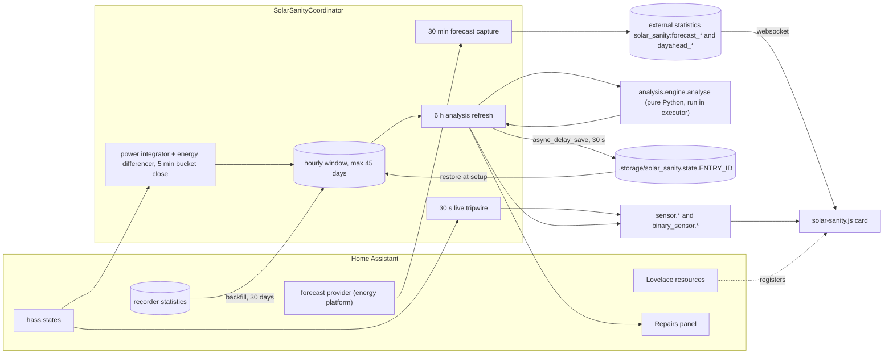

# Solar Sanity: architecture

A map of the repository for someone who has to change it. It covers what each
top-level folder is for, how the integration runs inside Home Assistant, how the
persistent store is provisioned, how build, test, lint and release work, and the
ten biggest risks or half-finished areas.

Surveyed on 2026-09-02 at commit `80429b4` (tag `v0.25.1`). Line numbers refer
to that commit and will drift. Nothing in the tree was changed to produce this
document. Every claim below was read from source, CI configuration or git
history, and the ones that matter most were checked twice.

Repository identity: the GitHub remote is `fadmaz/ha-solar-sanity`, the
integration domain is `solar_sanity`, and the local directory name
`ha-smart-solar-manager` is a leftover from before the domain was renamed. The
directory name does not appear anywhere in the code.

---

## 1. What this is, in one screen

Solar Sanity is a HACS custom integration for Home Assistant that checks whether
a household's solar, grid, battery and load sensors agree with each other. Over
any hour, energy in must equal energy out:

```
solar + grid import + battery discharge = house load + grid export + battery charge
```

The integration collects hourly energy per mapped channel, hands the window to a
pure-Python analysis engine every six hours, and publishes the result as one
status sensor (`ok`, `insufficient_data`, `not_checkable`, `investigating`,
`fault_found`), a `problem` binary sensor, a handful of supporting sensors, and
at most one finding in Home Assistant's Repairs panel. A Lit-based Lovelace card
renders the verdict and, separately, an archived day-ahead solar forecast.

Two design rules shape everything:

- **Silence is the product.** The stated budget is fewer than one false finding
  per two hundred installations per year. A per-channel estimate that does not
  snap onto a small set of physically nameable faults produces no finding at
  all, possibly forever.
- **The engine is pure.** `analysis/` imports nothing from Home Assistant, uses
  no third-party numerics, and is deterministic. That is enforced by tests, not
  by convention.

It deliberately does not report money, does not control hardware, and does not
draw a power-flow diagram.

---

## 2. Top-level layout

| Path | What it is | Notes |
| --- | --- | --- |
| `custom_components/solar_sanity/` | The integration. This directory, flattened, is the release zip that HACS installs. | 18 Python modules, `manifest.json`, `services.yaml`, `strings.json`, `translations/`, `brand/`. |
| `custom_components/solar_sanity/analysis/` | The pure analysis engine (10 modules, about 6,300 lines). | No `homeassistant` imports; hand-rolled linear algebra in `linalg.py`. |
| `custom_components/solar_sanity/frontend/` | Build output for the card (`solar-sanity.js` and its map). | **Git-ignored** (`.gitignore:182-185`). Exists only after `npm run build` or inside the release zip. |
| `frontend/src/` | TypeScript source of the card bundle: two cards, two editors, a dashboard strategy, a chart helper, hand-vendored HA types. | Tests sit beside the code as `*.test.ts`. |
| `tests/` | Three tiers: pure engine tests in `tests/analysis/` and `tests/unit/`, Home Assistant integration tests in `tests/integration/`, and top-level meta-tests that check the repository itself. | `tests/synth/` is a synthetic-house generator and a diagnostics replayer, not a test tier. |
| `scripts/` | `check.py` (runs every gate in CI order and stops at the first failure), `check_size.py` (gzip budget for the bundle, 90 kB) and `make_brand_assets.py` (regenerates `brand/*.png`, needs Pillow). | None is a dependency of the product. |
| `.github/` | `workflows/validate.yml` (seven jobs), `workflows/release.yml`, `dependabot.yml`. | See section 7. |
| `pyproject.toml` | pytest and ruff configuration only. The `[project]` table (`version = "0.1.0"`, no dependencies, no build backend) is a placeholder; nothing reads it and the package is not pip-installable. | The comments in it are the best explanation of the test setup anywhere in the repo. |
| `requirements-dev.txt` | Python test dependencies. One deliberate exact pin, see section 7.5. | |
| `package.json`, `package-lock.json`, `vite.config.ts`, `vitest.config.ts`, `tsconfig.json` | Card toolchain: Lit 3, TypeScript 7, Vite 8 (Rolldown + Oxc), Vitest 4 with happy-dom. | `package.json` version `0.1.0` is also a placeholder. |
| `hacs.json` | HACS metadata: `zip_release`, `filename: solar_sanity.zip`, minimum Home Assistant `2025.1.0`, `hide_default_branch`. | The declared minimum is wrong, see risk 4. |
| `README.md`, `CHANGELOG.md`, `LICENSE` | User-facing documentation, the release log (52 entries dated 2026-08-25 or later), MIT licence. | Parts of the README have fallen behind the code, see risk 7. |

Ignored local directories you will see but git does not: `.venv/`, `node_modules/`,
`.pytest_cache/`, `.ruff_cache/`, `.coverage`, `__pycache__/`.

---

## 3. Runtime architecture

### 3.1 Module map, in reading order

| Module | Responsibility |
| --- | --- |
| `const.py` | Every tunable with a comment saying which failure set it: config and option keys, storage keys, the four cadences, the two external-statistic prefixes. |
| `_match.py`, `_local_time.py`, `_identity.py`, `_forecast_plan.py` | Small Home-Assistant-free rule modules so they can be unit tested without HA: whole-word keyword matching, local-day resolution with DST awareness, same-house overlap detection, and which forecast hours to archive. |
| `entity.py` | One `CoordinatorEntity` base: `has_entity_name`, unique id `f"{entry_id}_{key}"`, one device per entry (`entity.py:22-31`). |
| `coordinator.py` | The measurement machine (1,502 lines): three sampling tiers, forecast capture, persistence, the analysis call, and every derived property the entities read. |
| `__init__.py` | Entry lifecycle, timer wiring, recorder backfill, service registration. |
| `sensor.py`, `binary_sensor.py` | Description-driven entities plus one forecast-bias sensor per provider. |
| `config_flow.py` | Setup wizard (`user` → `overlap` → `topology`), reconfigure, options. |
| `discovery.py` | Ranked candidate sensor mapping seeded from the Energy Dashboard. |
| `repairs.py` | Findings as Repairs issues, the correction fix flow, the orphan sweep. |
| `statistics_source.py` | All recorder reads and the two external forecast archives. |
| `scoring.py`, `yield_check.py` | Forecast-versus-actual bias, and a year of generation against an installer's guarantee. |
| `frontend.py` | Serves and registers the built card. |
| `diagnostics.py` | Redacted download that includes a replayable window. |

### 3.2 Data flow



### 3.3 Config entry lifecycle

1. `async_setup` (`__init__.py:63`) runs once per install: resolves a version
   string, registers the card with the frontend, registers the three services.
   `CONFIG_SCHEMA` is `config_entry_only_config_schema`, so nothing is
   YAML-configurable.
2. `async_setup_entry` (`__init__.py:75`) builds `SolarSanityCoordinator`,
   calls `async_restore` (section 5), runs the recorder backfill, then
   `async_config_entry_first_refresh`. It stores `SolarSanityData(coordinator,
   store)` on `entry.runtime_data` (`:83`), registers four `async_on_unload`
   hooks (30 s live tripwire, power state-change tracker, 5 min bucket tick,
   30 min forecast capture), forwards the two platforms, sweeps orphaned
   Repairs issues across every entry, and syncs this entry's issues.
3. `async_unload_entry` (`:141`) only unloads platforms; the timers are on
   `async_on_unload`. The store file is left in place.
4. `async_remove_entry` (`:146`) deletes the entry's Repairs issues and its
   per-entry store file.
5. There is no `async_migrate_entry`; `ConfigFlow.VERSION = 1`.

**Reloads are listener-free by policy.** CI fails on any `add_update_listener`
(`validate.yml:101-108`) because combining it with the reloading flow helpers
is an error from Home Assistant 2026.12. Reloads come from three explicit
places: `OptionsFlowWithReload` for options (`config_flow.py:456`),
`async_update_reload_and_abort` for reconfigure (`:422`), and
`async_schedule_reload` after a correction is applied (`repairs.py:196`).

### 3.4 The coordinator's four cadences

| Cadence | Constant | What happens |
| --- | --- | --- |
| 30 s | `LIVE_INTERVAL` (`const.py:50`) | `capture_live` reads `hass.states`; aborts entirely if any channel is an energy sensor or is older than `LIVE_MAX_AGE_SECONDS`. Feeds the live residual only. |
| on state change, closed every 5 min | `BUCKET_INTERVAL` (`const.py:69`) | Power sensors are integrated left-Riemann over held durations (`coordinator.py:427-499`); cumulative energy sensors are differenced with reset and staleness guards (`:342-419`). `_close_bucket` (`:553`) stamps a `Quality` and `BucketSource` per channel and discards an hour whose gap exceeds `POWER_GAP_TOLERANCE_SECONDS`. |
| 30 min | `FORECAST_CAPTURE_INTERVAL` (`const.py:102`) | `async_capture_forecasts` (`coordinator.py:678`) pulls each selected provider through the public energy platform and writes two external statistic series per provider (section 3.8). |
| 6 h | `ANALYSIS_INTERVAL` (`const.py:88`) | `_async_update_data` (`coordinator.py:828`) builds an `AnalysisRequest`, runs `analysis.engine.analyse` in an executor (`:844`), caches the fitted `LossModel`, persists, scores forecasts, and runs the yield check (`:849-851`). Also triggered by the `validate_now` service. |

Backfill (`__init__.py:165-220`) classifies each mapped entity as sum-backed,
mean-backed or unrecorded, pulls `BACKFILL_DAYS = 30` of hourly statistics and
calls `ingest_backfill` (`coordinator.py:622`), which never overwrites an hour
already present. Restore runs before backfill on purpose: an hour this
integration measured itself is an attestation that a mean re-derived from the
recorder cannot be. The window is capped at `MAX_BUCKETS = 24 * 45`
(`coordinator.py:97`).

### 3.5 Entities and the honesty rules

Unique ids are `f"{entry.entry_id}_{key}"`. Sensors (`sensor.py:114-173`):
`status` (enum), `data_completeness`, `corrections_active`,
`expected_tomorrow`, `expected_tomorrow_corrected`, `live_residual`
(diagnostic, disabled by default), plus one `forecast_bias_<provider>` per
configured provider. The binary sensor `data_healthy` has device class
`problem`, inverted.

The rules the tests in `tests/test_entity_honesty.py` and
`tests/test_live_state_honesty.py` pin:

- An entity that can never hold a value is not created: `live_residual` is
  filtered out unless `coordinator.has_live_tier` (`sensor.py:187-191`).
- Unknown is not zero: `channel_completeness` returns `None` until something
  has been read at least once, and only reports 0 after `COMPLETENESS_GRACE`
  expires (`coordinator.py:1120-1157`).
- Unavailable when unknowable: the binary sensor's `available` is
  `super().available and self.is_on is not None` (`binary_sensor.py:92`), and
  it returns `None` for `insufficient_data` and `not_checkable`.
- Judgements carry no `state_class`: the bias sensor publishes a snapped,
  reportable percentage rather than the raw measurement (`sensor.py:212-222`).

### 3.6 Config flow and discovery

`async_step_user` (`config_flow.py:242`) pre-fills from `async_discover`,
which reads Energy Dashboard statistic ids (`discovery.py:153`), expands to
device and config-entry siblings, excludes entities belonging to forecast
integrations, and ranks candidates by unit, device class and whole-word
keywords, demoting names that match both directions of a flow. Validation:
load and PV are required, no entity may be mapped twice, and `find_overlap`
blocks a second entry that shares a load sensor with an existing one. The
`topology` step asks only the questions the mapping does not already answer.
Reconfigure mirrors the wizard and merges options by hand because the HA
helper replaces them. The battery state-of-charge entity (0.25.x) is offered
in the wizard and in reconfigure but is stored in `entry.options`, not in
`CONF_CHANNELS`, and takes no part in the energy arithmetic.

### 3.7 Repairs

`async_sync_issues` (`repairs.py:94`) reconciles the panel to the report: one
issue at a time, only when severity is above `NOTE`, firing
`solar_sanity_finding_raised` and `_cleared` events. Findings that carry an
`offered_correction` get `ApplyCorrectionFlow`; everything else gets a confirm
flow. `async_sweep_orphans` (`:60`) runs at every setup across the whole
domain and deletes issues whose suffix matches no configured entry. Unload
does not touch issues, because HA records user dismissal against the issue and
flapping it would lose that. User-level suppression of a finding code lives in
`entry.options[OPT_SUPPRESSED]` and is offered only for codes this house has
actually seen (`config_flow.py:504-529`).

### 3.8 Services and the forecast archive

Three services, registered once in `async_setup` (`__init__.py:223-305`):
`validate_now` (backfill then refresh every entry), `export_report` and
`rescore_forecasts` (both `SupportsResponse.ONLY`).

For each selected forecast provider, `statistics_source.py` writes two external
series: `solar_sanity:forecast_<entry id>` (rolling, idempotent) and
`solar_sanity:dayahead_<entry id>` (write-once at 12 h or more of lead time).
Entry ids are lower-cased because the recorder refuses uppercase ULIDs
(`statistics_source.py:229-242`, pinned by `tests/test_statistic_ids.py`).
Only one entry owns a provider's archive, elected by the smallest entry id
among loaded entries. Metadata is `mean_type=StatisticMeanType.NONE`,
`has_sum=True`, `unit_class="energy"`; CI greps for both fields and forbids
`async_add_external_statistics` anywhere else. `scoring.py` compares the
day-ahead archive with measured PV buckets; `yield_check.py` compares 365 days
of PV against a configured guarantee and never annualises a shorter archive.

---

## 4. The analysis engine

### 4.1 Contract

`analysis/` is pure, deterministic, standard-library only. This is enforced:

- `tests/analysis/test_invariants.py:44` walks every module's AST and fails on
  any `homeassistant` import, any import escaping the package, any third-party
  dependency, any absolute self-import, and any import of clock or randomness.
- `pyproject.toml:58` adds `custom_components/solar_sanity` to `pythonpath` so
  `analysis` is importable with HA absent. The comment calls this "a structural
  purity guarantee, not a convention".
- `linalg.py` implements least squares with per-column scaling and partial
  pivoting, and a deterministic Theil-Sen slope, so the integration installs on
  a Raspberry Pi without wheels and produces byte-identical output run to run.

### 4.2 Pipeline

Single entry point: `analyse(request) -> AnalysisReport` (`engine.py:199`).
Input is `AnalysisRequest` (`model.py:315`): channel specs, hourly `Bucket`s in
Wh with parallel quality and source maps, live snapshots, declared topology,
active corrections, suppressed codes, a previously fitted loss model,
unrecorded keys, the UTC offset, and the daily state-of-charge swing.
`Bucket.value()` returns `None` unless quality is `OK` or `DERIVED_FROM_MEAN`;
nothing is ever imputed or zeroed.

1. Apply active corrections to the engine's own copy (`engine.py:209`).
2. Stage 0, stale corrections: a correction is stale when dropping it would
   make the house `ok` and keeping it would not (`:1525`).
3. Stage A, categorical screens (`screen.run_all`, `screen.py:636`): frozen
   channels, cumulative counters that never move, signed-net misdeclarations,
   stalled production, in a documented precedence order.
4. Unrecorded channels → `not_checkable`, naming the sensor (`:258`).
5. Closure (`topology.check_closure`, `topology.py:150`): can the identity
   close at all with this channel set and these declarations?
6. Residual by local day (`residual.build_days`, `residual.py:252`): raw sum,
   fitted expected loss, loss-corrected residual, and a band of clean, watch or
   actionable (`CLEAN_DAILY_PCT = 0.04`, `ACTIONABLE_DAILY_PCT = 0.10`).
7. Regime split (`regime.find_latest_change`), then joint loss fit
   (`topology.fit_loss_model`, `topology.py:358`), then days rebuilt.
8. Topology estimate (`topology.infer`, `:1033`) and residual summary.
9. Verdict gates: `_would_be_ok` (12 clean days of 14), `_structural_finding`,
   `_enough_to_attribute` (8 non-clean days), `_adds_up_over_the_day`,
   `_restricted_report`.
10. Attribution: `hypotheses.generate` / `score` / `passes_gates`, rendered by
    `_render_hypothesis` into a single `Finding`.

Output `AnalysisReport` (`model.py:362`): status, at most one finding,
`identity_fails`, notes, measurements, deferred codes, topology, loss model,
residual summary, reason.

### 4.3 Topology and the loss model

The principle at `topology.py:1-6`: ask the user what they know (is there a
battery), infer what they cannot (does the PV sensor read before or after the
inverter). A PV coefficient inside `DC_MEASUREMENT_WINDOW = (0.02, 0.10)`
(`faults.py:101`) is read as a topology fact, not a fault. The loss model
(`model.py:234`) holds `pv_dc_gamma`, `battery_dc_gamma`, `standby_w` and,
crucially, `fitted_terms`, because "we could not tell" and "measured as
lossless" are otherwise byte-identical. Charge and discharge lose different
fractions, so the charge coefficient must equal `gamma / (1 - gamma)` of its
partner, and `DC_BATTERY_DIRECTION_TOLERANCE = 0.35` refuses a pair that does
not agree. Vetoes: `DC_PV_MAX_GAMMA = 0.15` (an inverter below 85 % is not
credible), `MAX_LOAD_PROPORTIONAL_SHARE = 0.04` (standby must not scale with
consumption), `STANDBY_PLAUSIBLE_W = (10, 120)`.

The night ledger (`topology.py:551`) totals every channel over one agreed set
of night hours, because medians do not compose, and fits battery loss and
standby as slope and intercept of the night residual against battery
throughput.

Since PR #73 all three loss terms emit a note when established
(`engine.py:745-765`), on the principle "absorb, but disclose": a silently
subtracted coefficient is an assumption shown to nobody.

### 4.4 Attribution: snap to physics or stay silent

`estimate_gamma` (`hypotheses.py:175`) takes the median of residual over
channel magnitude across the upper quartile of a channel's hours.
`SNAP_TABLE` (`faults.py:81`) is the set of nameable faults, each with a centre
band and a maximum spread:

| Estimate | Meaning |
| --- | --- |
| about 0 | healthy |
| +0.02 … +0.10 | measured before the inverter, a topology fact |
| +1 | counted twice |
| +2 | sign backwards |
| −1 | one clamp on a two-conductor supply |
| −2 | one clamp on a three-phase supply |
| −999 | kW reported as W |

Seven conjunctive gates (`hypotheses.py:650-691`): explained share at least
0.80, margin over the runner-up (0.15 categorical, 0.25 free-parameter), at
least 4 supporting days, enough evaluated days, coefficient of variation at
most 0.15. `MIN_HOURS_FOR_SNAP = 160` is derived from 40 upper-quartile hours
and gives the "about a week to name a sensor" figure; structural findings
need `MIN_DAYS_EVALUATED = 5`. "One finding at a time" is structural:
`AnalysisReport.finding` is a single optional field and losers go to
`deferred` as codes only.

### 4.5 Regime change

`regime.py` detects a meter that changed what it reports, written against the
reference installation whose battery throughput stepped five-fold overnight.
`find_latest_change` walks each channel's daily throughput from the end
backwards and takes the most recent cut where no day on one side is within
`STEP_RATIO = 2.0` of any day on the other, with at least `MIN_REGIME_DAYS = 5`
per side. The engine then truncates to the new regime and refuses a verdict
until it is `VERDICT_WINDOW` long. Since 0.25.0 the daily state-of-charge
swing, which comes from the battery rather than the meter, decides whether
the equipment changed or its reporting did (`SAME_WITHIN = 1.33`,
`DIFFERENT_BEYOND = 2.0`, undetermined in between).

### 4.6 Where the thresholds live

The README says these are still being tuned. They are all module-level
constants:

| Constant | Value | Location |
| --- | --- | --- |
| `MIN_DAYS_OF_DATA` | 5 | `engine.py:50` |
| `VERDICT_WINDOW` | 14 | `engine.py:64` |
| `MIN_CLEAN_DAYS_FOR_OK` | 12 | `engine.py:78` |
| `MIN_UNSETTLED_DAYS` | 8 | `engine.py:109` |
| `MAX_WINDOW_IMBALANCE` | 0.025 | `engine.py:138` |
| `DUPLICATE_MAX_MISMATCH` | 0.08 | `engine.py:185` |
| `CLEAN_DAILY_PCT`, `ACTIONABLE_DAILY_PCT` | 0.04, 0.10 | `residual.py:44,49` |
| `MIN_VALID_BUCKETS_PER_DAY` | 18 | `residual.py:82` |
| `MIN_EXPLAINED`, margins | 0.80, 0.15, 0.25 | `hypotheses.py:101-106` |
| `MAX_GAMMA_CV` | 0.15 | `hypotheses.py:109` |
| `MIN_HOURS_FOR_SNAP` | 160 | `hypotheses.py:40` |
| `DC_MEASUREMENT_WINDOW` | (0.02, 0.10) | `faults.py:101` |
| `DC_PV_MAX_GAMMA` | 0.15 | `topology.py:61` |
| `DC_BATTERY_DIRECTION_TOLERANCE` | 0.35 | `topology.py:80` |
| `MIN_JOINT_FIT_HOURS` | 168 | `topology.py:34` |
| `STEP_RATIO`, `SAME_WITHIN` | 2.0, 1.33 | `regime.py:60,205` |

Most of these are pinned only indirectly, by the synthetic corpus staying
silent, rather than by a test that names them.

### 4.7 Synthetic corpus

`tests/synth/house.py` builds a seeded 30-day house whose identity closes to
1e-9 Wh per hour before any corruption; each corruptor breaks exactly one
thing. `tests/synth/corpus.py` crosses 5 topologies × 5 loss profiles × 2
seasons × 3 noise levels × 2 gap settings × 10 seeds = 3,000 healthy
scenarios; `FAST_SEEDS = range(0, 10, 5)` gives the 600-scenario subset that
runs on every pull request. `tests/synth/replay.py` rebuilds an
`AnalysisRequest` from a real diagnostics download, raising rather than
guessing on unknown codes.

---

## 5. How a store gets provisioned

"Store" here is `homeassistant.helpers.storage.Store`, the JSON file under the
config directory's `.storage/` that survives restarts. Solar Sanity keeps one
per config entry. A second, unrelated registration into Lovelace's resource
collection is covered in 5.7.

### 5.1 Sequence

1. `SolarSanityCoordinator.__init__` (`coordinator.py:215-226`) constructs two
   `Store` objects eagerly, with no I/O:
   - `self._store = Store(hass, STORAGE_VERSION, f"{STORAGE_KEY_STATE}.{entry.entry_id}", minor_version=STORAGE_MINOR_VERSION)`,
     which maps to `.storage/solar_sanity.state.<entry_id>` at version 1,
     minor 1 (`const.py:38-40`).
   - `self._legacy_store`, the same at the unkeyed `solar_sanity.state`.
   The comment at `:212-214` explains the per-entry key: one shared file let
   two installations overwrite each other's fitted loss model, and the second
   entry silently inherited a model fitted on a different house.
2. `async_setup_entry` calls `await coordinator.async_restore()`
   (`__init__.py:78`). This is the first I/O.
3. Backfill from the recorder runs after restore, deliberately, so restored
   hours win over re-derived ones.
4. `async_config_entry_first_refresh` runs the analysis, and `_async_persist`
   calls `async_delay_save(lambda: payload, 30)`. **The first file appears
   about 30 s after setup**, not during it.
5. `entry.runtime_data = SolarSanityData(coordinator, store=coordinator._store)`
   (`__init__.py:83`). The `store` field is never read anywhere.

The legacy unkeyed store is a read-only, single-hop rescue from the
single-entry era (0.5.0): it is read only when the per-entry load returns
nothing (`coordinator.py:1015`), never written, and never deleted.

### 5.2 What is persisted

`_async_persist` (`coordinator.py:947-986`) writes one dict:

| Key | Contents | Read back on restore? |
| --- | --- | --- |
| `loss_model` | `pv_dc_gamma`, `battery_dc_gamma`, `standby_w`, `samples` | yes |
| `last_status` | the report's status | no |
| `last_finding` | the finding code or `None` | no |
| `retention_days` | `DIGEST_RETENTION_DAYS` = 400 | no |
| `window` | columnar snapshot: `keys`, `quality_codes`, `source_codes`, `columns`, `rows` of `[start_utc, seconds, [wh...], quality chars, source chars]` | yes |

The window is emitted unrounded on purpose (`:1173-1179`): rounding moved a
replayed residual from 5e-16 to 3e-06. The docstring measured 82 kB for 727
hours and 122 kB at the full window, and argues that what is restored is an
attestation of completeness, not a better number. The same
`window_snapshot()` feeds the diagnostics download. Code tables
`_QUALITY_CODE` and `_SOURCE_CODE` (`:110-122`) are inverted for decoding so an
unemitted code is a refused code; `tests/test_window_snapshot.py` pins them.

Dismissed findings are not in the store; they live in
`entry.options[OPT_SUPPRESSED]`. Forecast history is not in the store; it goes
to the recorder as external statistics.

### 5.3 Restore semantics

`async_restore` (`:988-1024`) tries the per-entry store, falls back once to the
legacy store, and returns silently if both are empty. `_restore_from`
(`:1026-1048`) wraps `async_load()` in a broad `except Exception`, logs a
warning naming the key, and returns `None`. The docstring records the 0.21
incident that made it broad: `Store` calls `_async_migrate_func` when versions
differ, the default raises `NotImplementedError`, and that took the whole
integration down at setup.

| Case | Outcome |
| --- | --- |
| Missing file, `None`, empty dict | fall through to legacy, then cold start from the recorder backfill |
| Corrupt JSON | Home Assistant itself moves the file aside and raises a storage-corruption repair issue; the coordinator's `except` keeps setup alive |
| Same major, different minor | HA accepts the data as-is and re-saves at the new minor |
| Different major | HA raises; the warning path resets the loss model and window |
| Malformed `loss_model` | `_loss_from_dict` (`:1487`) returns `None` |
| Malformed `window` | `_buckets_from_snapshot` (`:1202-1257`) returns an empty list rather than a partial one, so a guess never lands in the one place treated as measurement |
| Keys that no longer match the mapping | not checked: buckets restore under stale keys and read as holes |

### 5.4 Save cadence

There is exactly one write call in the integration, `coordinator.py:986`, and
it is `async_delay_save` with a 30 s debounce. It runs unconditionally at the
end of every `_async_update_data`: at first refresh, every 6 h, and on
`validate_now`. The 30 s and 5 min ticks never save. There is no dirty check;
the full payload is re-serialised each time. Size is bounded by
`MAX_BUCKETS`, so roughly 122 kB is the ceiling.

### 5.5 Versioning contract

`STORAGE_VERSION = 1`, `STORAGE_MINOR_VERSION = 1`. No `_async_migrate_func`
exists; the coordinator uses `Store` directly. The contract is held by
`tests/test_storage_contract.py`, which runs without Home Assistant:

- `HISTORICAL_STORAGE_VERSIONS = ((1, 1),)` must end with the current pair.
- The list must be sorted and unique.
- Once `STORAGE_VERSION` is not 1, the string `_async_migrate_func` must appear
  in `coordinator.py`.

Round-trip fixtures in `tests/integration/test_storage_round_trip.py:27-44`
write the full HA envelope (`version`, `minor_version`, `key`, `data`) into
the `hass_storage` fixture before setup. They cover `loss_model` and the
version-mismatch path; the `window` half is exercised separately in
`tests/integration/test_window_survives_restart.py`.

To change the schema: append the previous pair to
`HISTORICAL_STORAGE_VERSIONS` in the same commit, add a fixture at the old
pair to the round-trip test, and for a major bump subclass `Store` with
`_async_migrate_func`.

### 5.6 Teardown

- **Unload**: platforms only; the file stays.
- **Reload** (options or reconfigure): a fresh coordinator with fresh `Store`
  objects re-reads the same file. `tests/integration/test_entry_lifecycle.py:105-123`.
- **Remove** (`__init__.py:146-162`): deletes the entry's Repairs issues, then
  builds a new `Store(hass, STORAGE_VERSION, key)` and calls `async_remove()`
  inside a try/except at debug level. The reason given: HA preloads every
  `.storage` file at boot, so an orphan costs every user startup time.

### 5.7 The other registration: the card as a Lovelace resource

`frontend.async_register` (`frontend.py:28-44`) registers `/solar_sanity` as a
static path over the bundled `frontend/` directory (returning quietly at debug
level if the directory does not exist, `:49-51`), then upserts a Lovelace
resource at `/solar_sanity/solar-sanity.js?v=<version>`, immediately if HA is
running and otherwise on `EVENT_HOMEASSISTANT_STARTED`. The version comes from
`hass.data["integrations"][DOMAIN].version` with a hard-coded `"0.1.0"`
fallback (`__init__.py:65-69`). Registration only works in storage-mode
Lovelace; in YAML mode it logs the URL to add by hand. It reads
`resource_mode` or `mode` because HA 2026.2 renamed the attribute (`:73-75`),
probes `hasattr(resources, "async_load")` to lazily load the collection
(`:88-89`), and converges on exactly one resource entry across restarts by
scanning for any URL that starts with the card path.

### 5.8 Gaps in this area

- A **minor** version bump is unguarded: HA silently accepts old data, so a
  minor bump that actually changes shape would ship undetected. Only the major
  bump has a test asking for a migration.
- `__init__.py:158` builds the removal `Store` without `minor_version`; harmless
  today, wrong the day the minor moves.
- The legacy unkeyed file is never deleted, so it is preloaded at every boot
  forever, which is exactly the cost the removal path cites.
- `last_status`, `last_finding` and `retention_days` are written and never
  read. `_async_persist`'s docstring promises "daily digests"; none exist and
  `DIGEST_RETENTION_DAYS` is never enforced.
- `async_remove()` on a freshly built `Store` cancels only that instance's
  pending write. A delayed save queued by the old coordinator can still flush
  at shutdown after a reload or removal.
- Nothing asserts the top-level payload keys; a rename of `window` or
  `loss_model` would be caught only because the round-trip fixtures happen to
  use those names.
- `frontend.py` has no test at all beyond an import smoke check.

---

## 6. The card

### 6.1 What ships

`frontend/src/main.ts` imports the editors and the strategy for their
side-effect registrations, re-exports the two cards, and pushes two entries
onto `window.customCards`: `solar-sanity-card` and
`solar-sanity-forecast-card`.

- **`solar-sanity-card`** (`status-card.ts:227-457`): three fixed grid rows,
  never more, so a dashboard does not reflow when something goes wrong. It
  needs no `entity:`; it finds the status sensor by matching the enum
  `options` list across `sensor.*` and refuses to guess when more than one
  installation matches. `verdictFor` is a pure switch over six inputs.
- **`solar-sanity-forecast-card`** (`forecast-card.ts:99-448`): one hand-rolled
  SVG chart per provider of the archived day-ahead forecast, with a screen
  reader table of the same numbers, an in-flight guard, a five-minute failure
  latch, and a midnight day-roll check. Accuracy scoring and money are
  explicitly not drawn, and a test asserts the words never appear.
- **Editors** (`editors.ts`): both wrap HA's `<ha-form>`. The forecast editor
  builds its provider dropdown from `recorder/list_statistic_ids` filtered to
  the day-ahead prefix.
- **Strategy** (`strategy.ts`): `ll-strategy-view-solar-sanity` and
  `ll-strategy-dashboard-solar-sanity` generate one status card per
  installation plus one forecast card.
- `types/hass.ts` is a hand-vendored eight-member subset of HA's types, chosen
  over `custom-card-helpers`.

### 6.2 The Python-to-TypeScript seam

| The card reads | From |
| --- | --- |
| `attributes.options` on `sensor.*` to find the status entity | `sensor.py:119-120` (`SensorDeviceClass.ENUM`) |
| `state`, `reason`, `headline`, `detail`, `days_of_data`, `notes` | `sensor.py:57-94` |
| `recorder/list_statistic_ids` and `recorder/statistics_during_period` over websocket | HA recorder |
| statistic id prefix `solar_sanity:dayahead_` | duplicated by hand: `forecast-data.ts:20` and `const.py:113` |
| metadata name suffix `" forecast, a day ahead"` | duplicated by hand: `forecast-data.ts:23` and `statistics_source.py:483` |

Nothing joins the duplicated constants across the language boundary.
`finding_code`, `source_fix`, `confidence`, `channels` and `deferred` are typed
in `hass.ts` and published by the sensor but never rendered.

### 6.3 Build, serve, cache-bust

`npm run build` is `tsc --noEmit && vite build`. `vite.config.ts` reads
`manifest.json` relative to itself, injects `__SS_VERSION__`, builds a single
ES2022 file minified with Oxc, with a source map, into
`custom_components/solar_sanity/frontend/`. The config comments record two
Vite 8 traps: `esbuild` as minifier now fails outright, and the option that
guarantees a single file inverted between Rollup and Rolldown
(`codeSplitting: false` is now the real one). The integration serves the
directory as `/solar_sanity` and registers `?v=<manifest version>`, so a
version bump forces every browser to refetch. Both ends derive from
`manifest.json`, which is why that file is canonical (`package.json` and
`pyproject.toml` once drifted to 0.1.0 against 0.7.0).

### 6.4 Tests and budget

Vitest under happy-dom, tests beside the code: chart primitives, the two
websocket call shapes, status-entity discovery against seven real third-party
`_status` sensors, the lead-sentence truncation against verbatim copy from
`faults.py`, the failure latch and midnight roll with fake timers, and editor
event escape across the shadow boundary. `bundle.smoke.test.ts` loads the
built file and asserts all four custom elements register, no dynamic import or
remote URL remains, and no literal `__SS_VERSION__` survives; it is
`describe.skipIf(!built)`, so with no bundle on disk it passes by skipping.
`scripts/check_size.py` fails above 90 kB gzipped; the bundle is 14.3 kB.

---

## 7. Build, test, lint, release

### 7.1 Test tiers

| Tier | Where | Needs HA | Local | Pull request | main and weekly | Selector |
| --- | --- | --- | --- | --- | --- | --- |
| Pure engine | `tests/analysis/` (21 files) | no | yes | yes | yes | default |
| Pure unit | `tests/unit/` | no | yes | yes | yes | default |
| Meta tests | `tests/test_*.py` | 8 of 11 modules `importorskip("homeassistant")` | partly | yes | yes | default |
| Fast corpus, 600 | `tests/analysis/test_clean_corpus.py:85` | no | yes | yes | yes | default |
| Full corpus, 3,000 | same file, `:94` | no | opt-in | **no** | yes | `-m slow -n auto` |
| Integration | `tests/integration/` (15 files) | **yes** | **no** | yes | yes | directory is only collected when HA is present |
| Card | `frontend/src/*.test.ts` | no | yes | yes | yes | `npm test` |

Measured on 2026-09-02 without Home Assistant installed:

```
python -m pytest tests -q        →  1791 passed, 8 skipped, 3000 deselected in 68.7 s
ruff check . / ruff format --check .  →  clean, 91 files
npm run lint / npm test          →  clean; 7 files, 130 tests, 2.8 s
python scripts/check_size.py     →  14.3 kB gzipped, within 90 kB
python scripts/check.py          →  all of the above in order, green in 117 s
```

Why it is shaped this way, from the comments in `pyproject.toml` and the
workflows:

- `asyncio_mode = "auto"` because `pytest-homeassistant-custom-component`
  declares `hass` and about twenty other fixtures as unmarked async fixtures,
  which strict mode silently never runs; `tests/integration/test_asyncio_mode.py`
  asserts the setting so a regression reads as one line, not twenty setup
  errors. The cost is a `PytestConfigWarning: Unknown config option` on every
  machine without pytest-asyncio.
- `addopts = "-m 'not slow'"` deselects the 3,000-scenario corpus by default,
  because "a gate nobody waits for is not a gate". The 600 subset still covers
  every axis combination at two seeds; the full run is what catches a false
  accusation that one seed in ten produces, and it runs without coverage
  because coverage makes the engine thirteen times slower.
- `tests/conftest.py:35-49` uses `pytest_ignore_collect`, not
  `collect_ignore_glob`, to refuse `tests/integration` when HA is absent,
  because the glob runs after the directory's conftest is imported and produces
  a collection error rather than an exclusion.
- `filterwarnings = ["error::DeprecationWarning:solar_sanity.*"]` is intended
  to turn the project's own deprecations into failures. No module is ever
  named `solar_sanity.*` (they import as `custom_components.solar_sanity.*` or
  `analysis.*`), so it currently matches nothing.

### 7.2 Local commands

Everything CI gates, in dependency order, stopping at the first failure
(`--slow` adds the full corpus):

```bash
python scripts/check.py
```

The individual pieces:

```bash
python -m pytest tests -q
```

```bash
python -m pytest tests -q -m slow -n auto
```

```bash
pip install -r requirements-dev.txt && python -m pytest tests/integration -q
```

```bash
ruff check . && ruff format --check .
```

```bash
npm ci && npm run lint && npm test
```

```bash
npm run build && python scripts/check_size.py
```

The integration tier needs a Python where Home Assistant installs (CI uses
3.13). On a machine without it, the eight `importorskip` modules skip and
`tests/integration` is not collected, so a green local run says nothing about
the HA seam. State that plainly in a pull request when it applies.

### 7.3 CI: `validate.yml`

Runs on every push, every pull request, and Mondays at 06:00 UTC ("upstream
breaks things on their own schedule, not ours").

| Job | What it does | Why it exists |
| --- | --- | --- |
| `hassfest` | `home-assistant/actions/hassfest@master` | manifest, strings and services validation |
| `hacs` | `hacs/action@main`, category integration | HACS repository rules |
| `tests` | Python 3.13, `pip install -r requirements-dev.txt`, `pytest tests -q` | the only place the integration tier ever runs |
| `corpus` | not on pull requests; `pytest -m slow -n auto`, then a grep that fails on any `async_register_command` | the full false-positive gate; `websocket_api` was removed from the manifest after years unused, and registering a command without it fails only for users |
| `lint` | unpinned `pip install ruff`; `ruff check .`; `ruff format --check .` | style and import order |
| `deprecations` | greps: `async_add_external_statistics` only in `statistics_source.py`, which must contain `mean_type=StatisticMeanType.NONE` and `unit_class="energy"`; no `add_update_listener` | omitting the metadata fields is a hard error in HA 2026.11; the listener combination is an error in 2026.12 |
| `card` | Node 22, `npm ci`, `npm run build`, `npm test`, `python scripts/check_size.py` | build must precede the smoke test or the smoke test skips |

### 7.4 Release: `release.yml`

Triggered by a published GitHub release, or by `workflow_dispatch` with a tag
so a failed upload can be retried. Steps, in an order that matters:

1. Check out the tag.
2. **Stamp** the tag's version into `manifest.json` with an inline Python
   heredoc.
3. **Then** `npm ci && npm run build`, so `__SS_VERSION__` carries the stamped
   version rather than whatever the previous release said.
4. `cd custom_components/solar_sanity && zip solar_sanity.zip -r ./`, flat,
   because HACS unpacks the zip's contents straight into the domain directory.
   Only `*.pyc` and `__pycache__` are excluded, so the 119 kB source map ships
   too.
5. Attach the zip and the raw `solar-sanity.js` with
   `softprops/action-gh-release`.

`hacs.json` sets `hide_default_branch: true`, so HACS never offers `main`,
where the built card does not exist.

### 7.5 Pins and version sources

`requirements-dev.txt` floors everything except
`pytest-homeassistant-custom-component==0.13.316`. The comment explains: it is
the newest release still declaring `Requires-Python >=3.13`, and that choice
is what selects Home Assistant 2026.2.3, pytest 9.0.0 and pytest-asyncio
1.3.0 underneath it. `tests/integration/test_collection_guard.py:24` asserts
the harness is at least 2026.1 so a downgrade fails loudly. Dependabot covers
npm weekly (grouped dev bumps) and GitHub Actions monthly; there is no pip
ecosystem entry, so the Python pins are only ever moved by hand.

The version lives in `custom_components/solar_sanity/manifest.json` and
nowhere else that matters. `pyproject.toml` and `package.json` both say
`0.1.0` and nothing reads them. `__init__.py:65` falls back to the string
`"0.1.0"` if the loader lookup fails.

---

## 8. The ten biggest risks and half-finished areas

Ranked by likelihood times impact. Each has the evidence, why it matters, and
what finished would look like.

### 1. The detector has met one roof

**Evidence.** `README.md:223` says validation has happened on one installation
and that the thresholds have never met a topology the author did not think
of. Six changelog entries say "found on a real installation"
(`CHANGELOG.md:37, 51, 91, 775, 1399, 1650`); everything else is synthetic.
The release cadence shows the same thing: 52 releases dated 2026-08-25 or
later, and the "installation changed" note shipped in 0.24.0 was patched in
four consecutive releases inside 48 hours (0.24.1, 0.24.2, 0.25.0, 0.25.1),
each fixing something the previous release had shown to a user.

**Why it matters.** The whole design budget is a false-finding rate, and a
rate cannot be measured from a sample of one. The 3,000-house corpus proves
silence on houses the author imagined, not on houses that exist.

**Finished looks like.** Verdict distributions from a second and third
machine with different topologies (the documented HACS beta channel exists for
this), and a soak period before user-facing copy ships.

### 2. The yield guarantee can never fire from the UI

**Evidence.** The options flow writes `guaranteed_annual_kwh` into
`entry.options` (`config_flow.py:461-472`, `async_create_entry(data={**options, **user_input})`).
`yield_check.py:81` reads `coordinator.entry.data.get(CONF_GUARANTEED_ANNUAL_KWH)`.
The wizard never collects it, and the reconfigure path's `data_updates`
carries only channels and topology (`:422-430`). The integration test seeds
the value into `data` directly (`tests/integration/test_yield_against_promise.py:44`),
so the suite is green while the only user-facing path is dead. Compare the
battery state-of-charge option, which is options on both sides.

**Why it matters.** A shipped, documented, tested feature that no user can
turn on, and the failure is silent: the check returns `None`, which is also
what "no guarantee configured" returns.

**Finished looks like.** Read from `entry.options`, and a test that drives the
options flow rather than seeding data.

### 3. The committed version is four releases behind, and two fallbacks say 0.1.0

**Evidence.** `manifest.json:22` says `0.21.1`; `CHANGELOG.md:5` and the
latest tag say `0.25.1`; `git show v0.25.1:custom_components/solar_sanity/manifest.json`
still says `0.21.1`. The manifest was last bumped in `1f5e995 chore: release 0.21.1`.
The release workflow stamps the tag into the manifest at build time, which is
why released zips are correct, but `release.yml:50-53` still describes a
hand-bump that stopped happening. `__init__.py:65` falls back to `"0.1.0"`,
and `pyproject.toml` and `package.json` both carry `0.1.0`.

**Why it matters.** Every local `npm run build` embeds `0.21.1`; any install
from a checkout reports `0.21.1` in the integrations page and in diagnostics;
the card cache-buster `?v=` has not moved for those installs across four
releases. A failed loader lookup would silently produce a version string that
collides with the placeholder files.

**Finished looks like.** Either bump the manifest in the release commit again,
or make CI assert that manifest, changelog head and tag agree, and remove the
`0.1.0` placeholders.

### 4. The declared Home Assistant floor cannot work

**Evidence.** `hacs.json` declares `"homeassistant": "2025.1.0"`. The code
imports `OptionsFlowWithReload` (`config_flow.py:31`), which arrived in Home
Assistant 2025.8, and writes `mean_type=StatisticMeanType.NONE` and
`unit_class="energy"` into external statistics metadata
(`statistics_source.py:270-280`), fields introduced with the October 2025
recorder API change for 2025.11. `frontend.py:73-75` handles an attribute
renamed in 2026.2. The only Home Assistant CI ever runs is 2026.2.3, fixed by
the harness pin.

**Why it matters.** On any Home Assistant release before 2025.8 the setup
wizard fails with an `ImportError` the moment it opens, because
`config_flow.py` imports the class at module level; before 2025.11 the
forecast archive would be written with metadata the recorder does not
understand. Nothing tests the real minimum, so nobody knows what it is.

**Finished looks like.** Raise the floor to the real minimum (2025.11 by the
evidence here) and run the test job on that version as well as the newest.

### 5. Card delivery rests on an untracked file and undocumented internals

**Evidence.** The built bundle is git-ignored (`.gitignore:182-185`) and only
the release workflow builds it. `frontend.py:49-51` returns at debug level
when the directory is missing, so a git-clone install gets a working
integration with an invisible card and no warning. The one test that inspects
the bundle is `describe.skipIf(!built)` (`bundle.smoke.test.ts:45`).
Registration goes through `hass.data["lovelace"]`, five `getattr` probes and
`resources.async_create_item` (`frontend.py:68-102`); the 2026.2 rename has
already broken it once. No test under `tests/` references `frontend.py`.

**Why it matters.** The seam most likely to break on a Home Assistant upgrade
is the one with no coverage, and its failure mode is silence.

**Finished looks like.** A warning-level log or a repair issue when the bundle
is missing; a test that drives `async_register` against a fake Lovelace
collection in both attribute shapes; and a CI step that fails, rather than
skips, when the smoke test finds no bundle.

### 6. A known dead zone in the loss fit, with the fix written down and not done

**Evidence.** `tests/analysis/test_clean_corpus.py:160-178` pins that a
healthy DC-coupled battery below 0.90 round-trip efficiency gets
`investigating` forever, and says so: "A known limitation, pinned. This
failing is good news." `tests/synth/corpus.py:85-92` excludes those houses
from the clean gate because "the engine does not yet reach a verdict on one".
`topology.py:82-100` explains why the obvious widening was measured and
rejected (the charge and generation columns are nearly collinear, so the
fitted coefficient wanders by 0.093 against a 0.125 signal) and ends: "Fixing
that means constraining the pair to one parameter and profiling over it
rather than fitting two free coefficients. Worth doing; not done here."

**Why it matters.** Real hardware in that band never gets an answer, and the
narrow band that does work is a cliff: rejection is all-or-nothing, so a
coefficient just outside the window means nothing is subtracted at all.

**Finished looks like.** The single-parameter constrained fit the comment
describes, and the pinned test moving down with it.

### 7. Prose that describes behaviour the code no longer has

**Evidence.** `README.md:91-95` and the docstring at
`tests/analysis/test_loss_notes.py:7-11` say the two conversion-loss notes are
"written and deliberately still silent" and point at
`TestTheDcNotesStaySilent`; that class is now `TestTheDcNotesAreSpokenNow`
(`:240`) and `engine.py:745-762` emits both notes. `README.md:160` says
"Scoring is not shipped yet"; 0.20.0 shipped the per-provider bias sensor and
0.22.0 the corrected-tomorrow sensor and `rescore_forecasts`. `README.md:306-321`
claims 887 tests, 104 card tests and 98 healthy scenarios against a measured
1,791, 130, and 600 fast plus 3,000 full. `const.py:11-13` is a docstring for
a WebSocket schema constant that was deleted, cut off mid-sentence.

**Why it matters.** This product's thesis is that it says exactly what it
measured. Documentation that says the opposite of the code undermines that,
and the README is what a HACS user reads before installing.

**Finished looks like.** A pass over the README against 0.25.1, and the test
docstring renamed with its class. The repo already asserts `services.yaml`
against `strings.json`; the same idea could cover the README's claims.

### 8. Side features fail into a debug log

**Evidence.** The yield check, the state-of-charge swing and forecast scoring
are each wrapped in `except Exception` that logs at debug and moves on
(`coordinator.py:865, 892, 911`). `_time_zone` and `_utc_offset_hours`
(`:926-944`) swallow any error into `None` or `0.0`, which silently groups
days by UTC. There are 23 bare `except Exception` blocks outside `analysis/`,
thirteen of them in `statistics_source.py`.

**Why it matters.** For a product whose silence is supposed to carry meaning,
a swallowed failure is indistinguishable from a considered "nothing to
report". A user whose scoring stopped working sees nothing change.

**Finished looks like.** Narrow the excepts to the exceptions the docstrings
name, and surface a degraded feature as a note or a diagnostic attribute.

### 9. Dead and half-wired surface

**Evidence.**

- Four fault codes have finished user copy and no producer anywhere:
  `CHANNELS_SWAPPED`, `MISSING_GENERATION`, `LOAD_BOUNDARY`, `UNEXPLAINED`
  (`faults.py:36-57`, referenced only there).
- `Role.BATTERY_SOC` (`model.py:31`) is never assigned to a channel; the SoC
  arrives out of band. `DC_MEASUREMENT_FAULT_THRESHOLD` (`faults.py:106`) and
  `STORAGE_MAX_ORTHOGONAL_EXPLAINED` (`hypotheses.py:120`) are never used.
- `bucket_window` (`coordinator.py:1501`) has no callers. `SolarSanityData.store`
  is set and never read. Three persisted keys are never read back and the
  promised daily digests do not exist (section 5.8).
- In the card, the `name` and `show_evidence` editor fields are declared,
  labelled and rendered (`editors.ts:80-89, 142-143`) and consumed nowhere in
  `status-card.ts`. Five typed attributes are published and never rendered.
- `forecast-data.ts:20, 23` duplicate a statistic-id prefix and a metadata
  name suffix from `const.py:113` and `statistics_source.py:483`, and the
  "12 hours" in card copy duplicates `DAYAHEAD_MIN_LEAD_HOURS`; nothing joins
  them.

**Why it matters.** Each is small; together they are the shape of features
started and left, and the editor fields are user-visible promises that do
nothing.

**Finished looks like.** Delete what is dead, wire or remove the two editor
fields, and either generate the shared constants or add a test that reads
both sides.

### 10. Two files are both the largest and the most changed

**Evidence.** `engine.py` is 1,775 lines and `coordinator.py` 1,502; they are
the two most-edited source files since mid-July (32 commits each). `analyse`
is 329 lines (`engine.py:199-525`) with about a dozen return points;
`_duplicate_pair` is 155, `_missing_export_hypothesis` 108, `screen_cumulative`
107. `pyproject.toml:64` disables every ruff complexity rule that would flag
them. `SolarSanityCoordinator` alone owns sampling, integration, capture,
persistence and reporting.

**Why it matters.** The churn is where the defects have been found, and the
size is what makes the next change risky. The re-fix streak in risk 1 is the
symptom.

**Finished looks like.** `analyse` split into the named stages it already
documents; the coordinator's persistence and forecast capture moved out; the
complexity rules re-enabled with a ceiling the current code passes.

### Also noted, smaller

- `has_live_tier` is decided once at platform setup from `hass.states`
  (`sensor.py:187-191`, `coordinator.py:1084-1097`). On an installation whose
  sensors publish after Home Assistant starts, which the reference install
  does, the `live_residual` entity is never created for that run.
- `strategy.ts:83-84` calls `customElements.define` without a guard, and
  `main.ts` pushes to `window.customCards` unconditionally; a second evaluation
  of the bundle throws and duplicates picker entries.
- `filterwarnings` in `pyproject.toml:59` matches no real module name.
- The `lint` job installs unpinned ruff and the `hassfest` and `hacs` jobs use
  `@master` and `@main`; any of them can go red on a commit that changed
  nothing.
- Two fault codes that were already public in entity attributes and events
  were removed in 0.22.0 with no deprecation window (`CHANGELOG.md:139-151`).
- The 0.90-efficiency cliff aside, `DC_MEASUREMENT_WINDOW` is still an
  all-or-nothing gate.
- No `SECURITY.md`, `CONTRIBUTING.md`, `CODEOWNERS`, issue templates or
  pre-commit config. The README asks strangers to send diagnostics that
  contain entity ids and a month of consumption, which is the case where
  `SECURITY.md` matters most. Merged branches are deleted on GitHub by hand,
  since auto-delete is off; a local clone accumulates stale `origin/*` refs
  until `git fetch --prune`.

---

## 9. Where to start reading

1. `custom_components/solar_sanity/const.py` for every knob and why it is set.
2. `analysis/model.py` for the data types, then `analysis/engine.py:199`
   (`analyse`) top to bottom.
3. `coordinator.py:150-350` for the three tiers, then `:828` for the refresh
   and `:947-1048` for persistence.
4. `__init__.py` for the lifecycle, then `config_flow.py`.
5. `pyproject.toml` and `.github/workflows/validate.yml` for the test setup;
   their comments are the design record.
6. `CHANGELOG.md` from the top: the entries explain what was found on real
   data and what each threshold cost.
